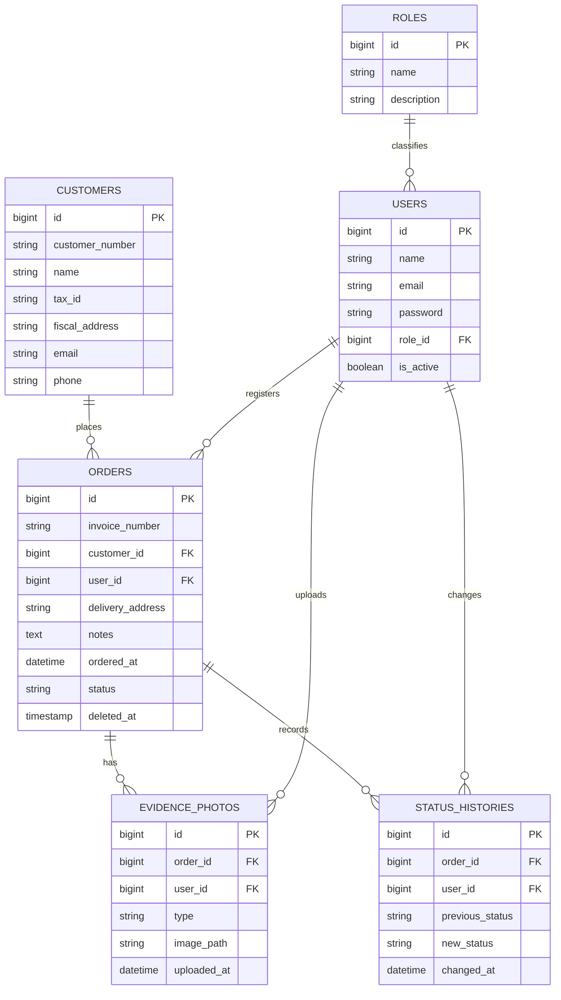

# Halcón — Order Tracking System

## Project description

**Halcón** is a construction material distributor that needs a web application to automate its internal processes and let its customers follow their orders.

The system has two parts:

- **Public screen for customers:** a customer enters their customer number and invoice number to see the status of their order (*Ordered*, *In process*, *In route* or *Delivered*). When the order is delivered, the photo that proves the delivery is displayed.
- **Administrative dashboard for employees:** the staff logs in according to their department (role):
  - **Admin:** comes by default with the system; registers new users and assigns their roles.
  - **Sales:** takes the customers' orders and registers them in the system.
  - **Purchasing:** buys missing materials from external suppliers.
  - **Warehouse:** prepares the orders, changes their status and reports low or missing stock.
  - **Route:** delivers the orders and uploads the loading and delivery photos.

Orders can be listed and searched by invoice number, customer number, date or status. They can be edited and **deleted logically** (they stay in the database but are hidden), and deleted orders can be listed and restored.

**Technologies:** Laravel 12, PHP 8.2+, MySQL.

## ER Diagram



Notes:

- Every table also has `created_at` and `updated_at` (Laravel `timestamps()`).
- `orders.deleted_at` implements the logical delete with Laravel's `SoftDeletes`.
- `customer_number` and `invoice_number` are unique.
- `evidence_photos.type` is `loading` (photo of the loaded unit) or `delivery` (proof of delivery).

## Repository structure

| Folder | Content |
|---|---|
| `docs/` | Evidence 1 documentation: methodology, BPMN, use case, class and activity diagrams, and the first ER diagram. |
| `halcon/` | Laravel project: models, relationships, migrations, seeders and factories. |

## Installation

```bash
cd halcon
composer install
cp .env.example .env
php artisan key:generate
```

Create a MySQL database called `halcon`, set `DB_CONNECTION=mysql` and the database credentials in `.env`, and then run:

```bash
php artisan migrate:fresh --seed
```

## Test data

The seeders and factories create:

- **5 roles:** Admin, Sales, Purchasing, Warehouse and Route (`RoleSeeder`).
- **Users** (`UserSeeder`), all with the password `password`:

  | Name | Email | Role |
  |---|---|---|
  | Administrator | admin@halcon.com | Admin |
  | Laura Méndez | sales@halcon.com | Sales |
  | Jorge Ramírez | warehouse@halcon.com | Warehouse |
  | Carlos Torres | route@halcon.com | Route |

- **20 customers** (`CustomerFactory`).
- **50 orders** (`OrderFactory`) with consecutive invoice numbers (`INV-00001` to `INV-00050`), each with its status history and, when the order is *In route* or *Delivered*, its evidence photos.
