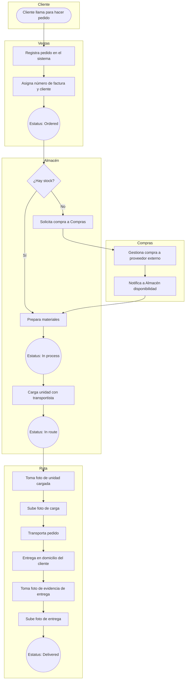
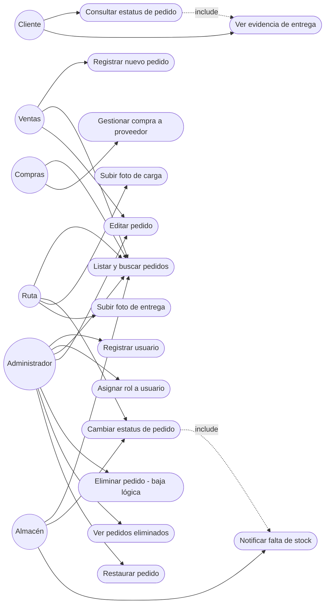
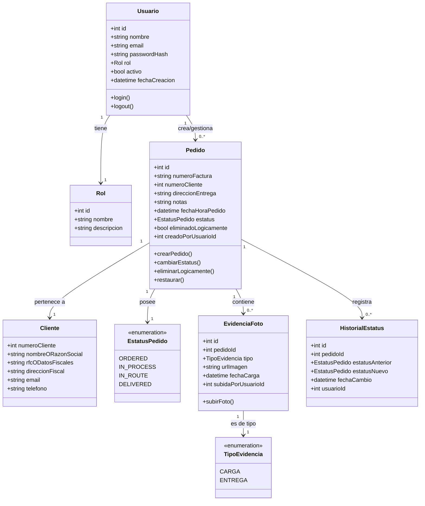
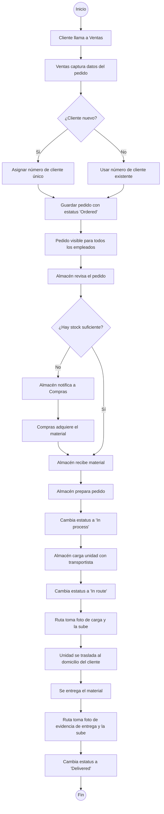
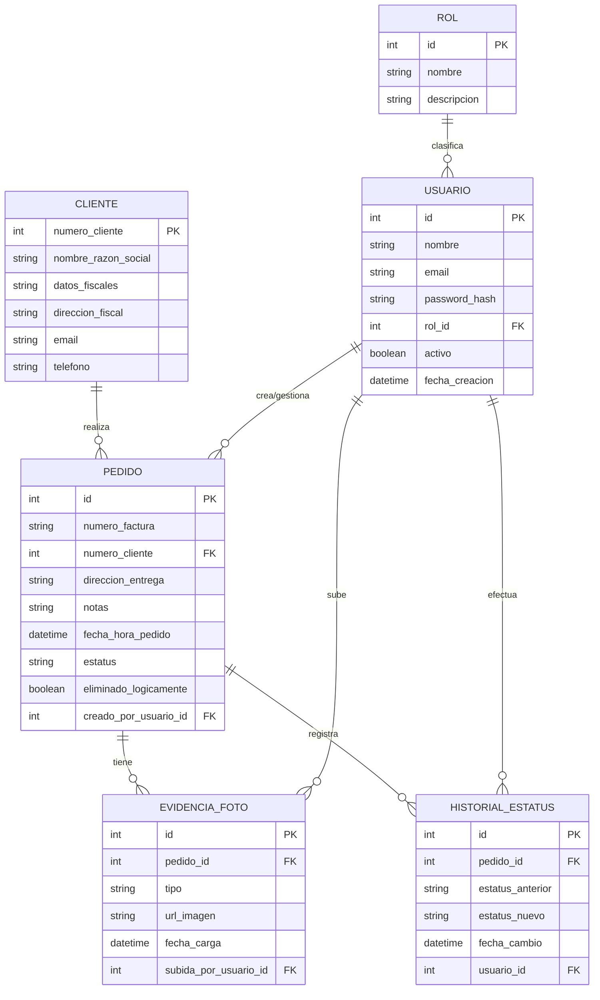

# Análisis y Planificación del Proyecto "Halcón" — Sistema de Seguimiento de Pedidos

## 1. Metodología de trabajo

### 1.1 Metodología elegida: **Scrum (marco ágil)**

**Justificación:**

Los requerimientos están organizados en módulos bien diferenciados, los cuales se pueden convertir directamente en un Product Backlog con historias de usuario por rol. Además, dado que el cliente no es técnico y necesita ver avances tangibles, los Sprints cortos con entregas incrementales permiten validar continuamente con el dueño del negocio. Por otro lado, el flujo de estados del pedido es un proceso vivo que probablemente se ajuste al usarlo en campo, y la naturaleza iterativa de Scrum permite adaptar reglas de negocio  sin retrabajo mayor. También hay funcionalidades de distinto riesgo técnico, por lo que Scrum permite priorizar en el Sprint Planning lo de mayor valor o riesgo primero .

## 2. Diagrama BPMN — Ciclo de vida del pedido

## 3. Diagrama de Casos de Uso

## 4. Diagrama de Clases

## 5. Diagrama de Actividades — Registro y avance de un pedido

## 6. Base de datos y Diagrama Entidad-Relación

### 6.1 Elección del motor de base de datos

**Motor elegido: PostgreSQL relacional**

**Justificación:**
Los datos del negocio son altamente estructurados y relacionales es decir, un pedido pertenece a un cliente, tiene un historial de estatus, y puede tener evidencias fotográficas asociadas, relaciones típicas de un modelo relacional con integridad referencial fuerte. Además los números de factura y de cliente deben ser únicos, consecutivos y consistentes, lo cual se garantiza fácilmente con restricciones `UNIQUE`, `SEQUENCE` y validaciones a nivel de esquema.

PostgreSQL soporta el almacenamiento de metadatos de archivos y es una tecnología robusta, gratuita, con gran soporte para roles y permisos a nivel de base de datos, lo cual complementa el control de roles de la aplicación.

### 6.2 Diagrama Entidad-Relación

## 7. Reflexión personal

Este caso, aunque parte de un problema aparentemente simple revela, al analizarlo a fondo, la complejidad típica de cualquier sistema de negocio real, es decir, múltiples roles con visibilidad y permisos distintos, un flujo de estados que debe respetarse estrictamente, evidencia documental que sirve como prueba legal/operativa, y la necesidad de no perder información histórica.

Elegir Scrum como metodología también obliga a pensar el proyecto en incrementos de valor real para el negocio, en lugar de en módulos técnicos aislados, cada sprint entrega algo que Halcón puede probar y retroalimentar, lo cual reduce el riesgo de construir funcionalidades que no resuelven el problema real del cliente. En conjunto, este ejercicio confirma que el tiempo invertido en análisis y modelado no es un paso burocrático, sino la base que evita retrabajo costoso en etapas posteriores del desarrollo.
